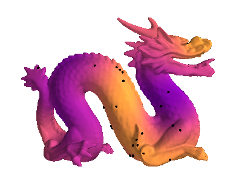
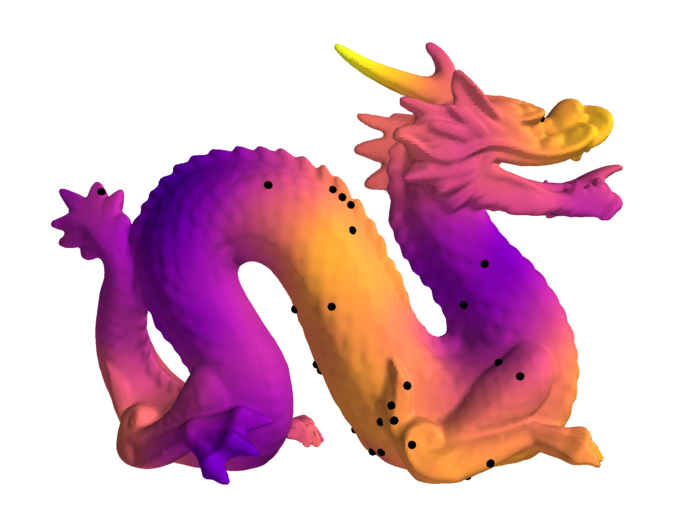
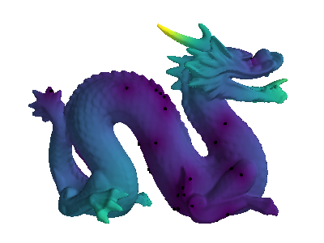

# Riemannian Gaussian Processes

<div>
  
  
  
</div>

## Disclaimer

This is supplementary code for the paper ["Matern Gaussian processes on Riemannian manifolds"](https://arxiv.org/abs/2006.10160).
Please note that the code is provided only as a demo.  The demo shows the example of a Gaussian process regression on the dragon manifold with a Matern kernel defined on the manifold. Additional info can be found in the paper and in the Appendix A.

## Preliminaries

We use and have run our code on Python 3.

The code relies heavily on the [Firedrake package](https://www.firedrakeproject.org). In order to run our demo, please follow the installation instructions of the Firedrake. **Note** that Firedrake may take some time to install.

You should also have [paramz](https://github.com/sods/paramz), [autograd](https://github.com/HIPS/autograd) and [networkx](https://networkx.github.io/) installed inside `firedrake` virtual environment. This could be done by a simple
```
pip install paramz autograd networkx
```
with `firedrake` virtual environment activated.

## Usage

To run our demo, activate `firedrake` virtual environment first by typing
```
source firedrake/bin/activate
```
in your terminal.

Then simply enter 
```
python demo_dragon.py
```

This will create a directory `output` where a number of `.pvd`-files will be saved such as files with the ground truth function, mean and standard deviation of the posterior GP, and a bunch of files with posterior samples (16 by default). The `.pvd`-files can be viewed, for example, with [Paraview](https://www.paraview.org/).

**Note** that depending on your computing power, several computationally heavy parts of the code may take a while to run.

If you wish, you can also obtain images like ones provided in the paper that you can see with your favorite image viewer by providing an option
```
python demo_dragon.py --mayavi
```

**Note** that that requires [Mayavi](https://docs.enthought.com/mayavi/mayavi/) to be *properly* installed. If `mayavi` is not installed, providing this option will not have any effect.

You can also play with the script by providing several options:
```
python demo_dragon.py --help
usage: demo_dragon.py [-h] [--num-eigenpairs NUM_EIGENPAIRS] [--seed SEED]
                      [--output-dir OUTPUT_DIR]
                      [--eigenpairs-file EIGENPAIRS_FILE] [--mayavi]
                      [--num-samples NUM_SAMPLES]

optional arguments:
  -h, --help            show this help message and exit
  --num-eigenpairs NUM_EIGENPAIRS
                        Number of eigenpairs to use. Default is 500
  --seed SEED           Random seed
  --output-dir OUTPUT_DIR
                        Output directory to save .pvd files to. Default is
                        ./output
  --eigenpairs-file EIGENPAIRS_FILE
                        .npy file with precomputed eigenpairs
  --mayavi              Render results to .png with Mayavi
  --num-samples NUM_SAMPLES
                        Number of random samples to generate
```

## Issues with `mayavi`

If you run into issues with `mayavi` rendering using `PyQt` backend you may want to use `wxPython` backend instead. See a corresponing [issue](https://github.com/enthought/mayavi/issues/656) on `mayavi` github. This issue may arise with the `Ubuntu 18.04` Linux distribution. Installing `wxPython` in `firedrake` virtual environment and setting
```
export ETS_TOOLKIT=wx
```
should fix this.

## Library usage
You can also use `manifold_matern` as a library to train a GP on a mesh. The library provides `ManifoldMaternGP` class:
```python
>>> from  manifold_matern import ManifoldMaternGP
>>> gp = ManifoldMaternGP(mesh, V, X, Y, eigenpairs)
>>> gp.optimize()
```
Please refer to the documentation for details and to our demo as an example.

## Citing
```
@article{borovitskiy2020,
    title={Matern Gaussian processes on Riemannian manifolds},
    author={Viacheslav Borovitskiy and Alexander Terenin and Peter Mostowsky and Marc Peter Deisenroth},
    journal={arXiv:2006.10160},
    year={2020}}
```
